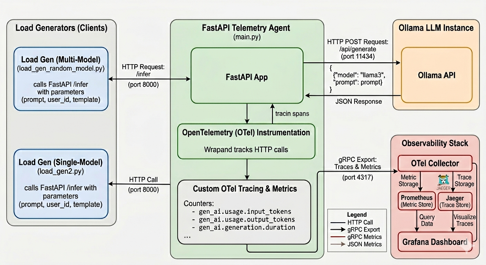

# 👁️ Oculum — Real-Time OpenTelemetry Observability for AI Agents

> *Oculum (Latin: "eye")* — A production-grade observability pipeline that captures every span, token, cost, and latency measurement across your local AI inference stack.

[](https://opentelemetry.io/)
[](https://python.org)
[](https://ollama.com)
[](LICENSE)

---

## Table of Contents

- [Overview](#overview)
- [Architecture](#architecture)
- [Project Structure](#project-structure)
- [Prerequisites](#prerequisites)
- [Environment Setup](#environment-setup)
  - [1. System Dependencies (Fedora)](#1-system-dependencies-fedora)
  - [2. Ollama with ROCm (AMD GPU)](#2-ollama-with-rocm-amd-gpu)
  - [3. Python Virtual Environment](#3-python-virtual-environment)
- [Running the Stack](#running-the-stack)
  - [Start the Telemetry Backend](#start-the-telemetry-backend)
  - [Start the llm-telemetry Agent](#start-the-oculum-agent)
- [Accessing the Dashboards](#accessing-the-dashboards)
- [Sending Your First Inference Request](#sending-your-first-inference-request)
- [Configuration Reference](#configuration-reference)
- [Stopping the Stack](#stopping-the-stack)
- [Troubleshooting](#troubleshooting)
- [Contributing](#contributing)

---

## Overview

This is a FastAPI-based LLM inference service with full OpenTelemetry (OTel) observability — it wraps calls to a locally running Ollama model and emits traces and metrics to a telemetry backend.

**The stack runs entirely on your local machine** — no cloud accounts, no API keys, no data leaving your network.

---

## Architecture



The **OTel Collector** is the gateway: the application sends all telemetry to a single OTLP endpoint, and the Collector fans it out to Jaeger (traces) and Prometheus (metrics). Adding a new backend requires only a Collector config change — not a code change.

---

## Project Structure

```
llm-telemetry/
│
├── main.py                         # FastAPI app — the instrumented LLM wrapper
├── requirements.txt                # Python dependencies
│
├── otel-config.yaml                # OTel Collector pipeline configuration
│                                   # Defines receivers (OTLP), processors (batch, resource),
│                                   # and exporters (Jaeger, Prometheus, debug)
│
├── prometheus.yaml                 # Prometheus scrape config
│                                   # Scrapes the Collector's metrics endpoint (:8889)
│
├── grafana/                        # Grafana dashboard exports
│
├── systemd/
│   └── ollama.service              # systemd unit file for running Ollama as a managed service
│
└── README.md                       # This file
```

### Key File Descriptions

| File | Purpose |
|---|---|
| `main.py` | Core application. Bootstraps the OTel `TracerProvider`, instruments FastAPI and Ollama, and exposes the `/infer` endpoint. |
| `otel-config.yaml` | Defines the full telemetry pipeline. Edit this to add or change backends without touching application code. |
| `prometheus.yaml` | Tells Prometheus where to scrape metrics. Targets the Collector's exposed Prometheus endpoint on port `8889`. |
| `grafana/dashboards/manual-exports/my_dashboard_<timestamp>.json` | Importable Grafana dashboard with token gauge, per-model latency, and request rate panels. |
| `load_gen.py` | Simulates a single-model workload (llama3) by sending random prompts to a FastAPI inference endpoint, cycling through different users and templates with randomized delays to generate realistic performance metrics for Grafana.|
| `load_gen_random_model.py` | Simulates a multi-model workload (llama3, mistral and phi3) by sending random prompts to a FastAPI inference endpoint, cycling through different users and templates with randomized delays to generate realistic performance metrics for Grafana.|
| `model_comparison.py` | Performs a comparative performance evaluation by iterating through a selection of diverse prompts across three different AI models—llama3, mistral, and phi3—while measuring their response success and latency.|
| `ratio_stress_test.py` | Stress-tests an LLM-telemetry system by simulating various input-to-output token ratios—ranging from highly efficient to heavily bloated—to verify that metrics are correctly captured and visualized within Prometheus and Grafana.|
| `simulate_stress.py` | Simulates varied request latencies by injecting normal, slow, and spiked data points into an OpenTelemetry histogram to verify that P50, P95, and P99 percentile visualizations are accurately reflected in Grafana.|
---

## Prerequisites

Ensure the following are installed on your **Fedora** machine before proceeding.

| Requirement | Version | Notes |
|---|---|---|
| Fedora | 39+ | Tested on Fedora 40/41 |
| Podman | 4.9+ | Used in place of Docker |
| Python | 3.11+ | Required for `opentelemetry-sdk` |
| pip | 23+ | Python package manager |
| Ollama | Latest | Local LLM engine |
| ROCm (optional) | 6.x | Required only for AMD GPU acceleration |

---

## Environment Setup

### 1. System Dependencies (Fedora)

Install Podman, Podman Compose, and Python development tools:

```bash
sudo dnf install -y podman python3 python3-pip python3-venv
```

Verify the installations:

```bash
podman --version
python3 --version
```

---

### 2. Ollama with ROCm (AMD GPU)

**Install Ollama:**

```bash
curl -fsSL https://ollama.com/install.sh | sh
```

> **AMD GPU Note:** The `ollama.service` unit file includes `HSA_OVERRIDE_GFX_VERSION=11.0.0`. This is required for the Radeon RX 7900 XT (`gfx1100` architecture) to be recognized by ROCm. If you are on a different AMD GPU, check your architecture with `rocminfo | grep gfx` and adjust accordingly. If you are on CPU only, remove that environment variable line entirely.

**Pull all needed models:**

```bash
ollama pull llama3
ollama pull mistral
ollama pull phi3
```
List all locally available models:

```bash
ollama list
```

For CPU-only machines, use a smaller model to keep inference responsive:

```bash
ollama pull llama3
```

**Verify Ollama is running:**

```bash
curl http://localhost:11434/api/tags
```

You should see a JSON response listing available models.

---

### 3. Python Virtual Environment

From the project root, create and activate a virtual environment:

```bash
python3 -m venv venv
source venv/bin/activate
```

Install all Python dependencies:

```bash
pip install -r requirements.txt
```

**`requirements.txt` Look at this file to see the updated list of requirements **

---

## Running the Stack

There are two parts to start: the **telemetry backend** (containers) and the **llm-telemetry agent** (Python).

### Start the Telemetry Backend

From the project root, bring up all containers using the script below:

```bash
scripts/llm-telemetry.sh start
```

This starts four containers:

| Container | Purpose | Port |
|---|---|---|
| `otel-collector` | Receives OTLP telemetry and routes it | `4317` (gRPC), `4318` (HTTP) |
| `jaeger` | Stores and visualizes distributed traces | `16686` (UI) |
| `prometheus` | Scrapes and stores metrics | `9090` |
| `grafana` | Dashboard visualization | `3000` |

Confirm all containers are running:

```bash
scripts/check_status.sh
```

Check the Collector logs to confirm it started cleanly:

```bash
tail otel.log
```

You should see output ending with:

```
Everything is ready. Begin running and processing data.
```

---

### Start the llm-telemetry Agent

With your virtual environment active, start the FastAPI application:

```bash
source venv/bin/activate
scripts/start-fastapi.sh
```

The agent starts on `http://localhost:8000`. Confirm the OTLP exporter connected successfully — you should see a log line indicating the `TracerProvider` is initialized and exporting to `localhost:4317`.

---

## Accessing the Dashboards

Once both the backend and the agent are running, open the following in your browser:

| Interface | URL | Credentials |
|---|---|---|
| **Grafana** (main dashboard) | http://localhost:3000 | `admin` / `admin` |
| **Jaeger** (trace explorer) | http://localhost:16686 | — |
| **Prometheus** (raw metrics) | http://localhost:9090 | — |
| **llm-telemetry Agent API docs** | http://localhost:8000/docs | — (Swagger UI) |


**In Grafana:**
To view your metrics, you will need to import the dashboard manually. The necessary configuration file is located within the project structure:

1. Navigate to the **Dashboards** section in your Grafana UI.
2. Select **Import**.
3. Upload the JSON file found in:  
   `grafana/dashboards/manual-exports/ai-observability<timestamp>.json`
   
Once imported, the **AI Observability** dashboard will provide live token gauges, latency graphs, and request rate panels. No additional manual configuration of panels is required.

**In Jaeger:** Select `llm-telemetry-agent` from the *Service* dropdown and click **Find Traces** to browse individual inference traces and their full waterfall breakdowns.

---

## Sending Your First Inference Request

With everything running, send a test request to the agent:

```bash
curl -X POST "http://localhost:8000/infer" \
  -H "Content-Type: application/json" \
  -d '{
    "prompt": "Explain OpenTelemetry to a Systems Architect in three sentences.",
    "user_id": "user-001",
    "template": "explain-v1"
  }'
```

Then open Jaeger at `http://localhost:16686`, select the `llm-telemetry-agent` service, and click **Find Traces**. You will see the new trace with a full waterfall: FastAPI routing → span creation → Ollama inference → response.

**To generate a continuous stream of data for the live Grafana dashboard**, run one of the load scripts described above (Key File Descriptions).


Switch to Grafana and watch the token gauge and latency panels update in real time.

---

## Configuration Reference

### Changing the Default Model

An example is found at `load_gen_random_model.py`. Essentially, you need to pass a model name to the params dictionary, which is sent as as a query parameter in the `session.post` request:

```python
model = 'mistral'
params = {
    "prompt": prompt,
    "user_id": user_id,
    "template": template,
    "model": model  
}
```

### Adding a New Telemetry Backend

Edit `otel-config.yaml`. To add Grafana Cloud as a second trace destination, add an exporter and reference it in the pipeline — no changes to `main.py` required:

```yaml
exporters:
  otlp/grafana-cloud:
    endpoint: <your-grafana-cloud-otlp-endpoint>
    headers:
      authorization: "Bearer <your-token>"

service:
  pipelines:
    traces:
      exporters: [otlp/jaeger, otlp/grafana-cloud, debug]
```

Restart the Collector to apply:

```bash
scripts/otel.sh restart
```

---

## Stopping the Stack

Stop all containers:

```bash
script/llm-telemetry.sh stop
```

---

## Troubleshooting

**Containers fail to start / port already in use**

Check for processes occupying the required ports:

```bash
ss -tlnp | grep -E '4317|4318|16686|9090|3000'
```

**No traces appearing in Jaeger**

1. Confirm containers are up: `podman ps`
2. Confirm the agent started and connected to the Collector on `localhost:4317`
3. Check Collector logs for export errors: `podman logs otel-collector`

**Grafana dashboard shows "No data"**

Confirm Prometheus is successfully scraping the Collector. Open `http://localhost:9090/targets` and verify the `otel-collector` target shows **UP**. If it shows DOWN, check that the Collector's Prometheus exporter is binding to `0.0.0.0:8889` in `otel-config.yaml`.

---

## Contributing

Pull requests are welcome. For major changes, please open an issue first. All new instrumentation should follow the [OpenTelemetry Semantic Conventions for LLM systems](https://opentelemetry.io/docs/specs/semconv/gen-ai/).

---

*Built on Fedora. Powered by OpenTelemetry, Ollama, and an AMD Radeon RX 7900 XT.*

To Warm up the 7900 XT run:

ollama run llama3 "warm up"
